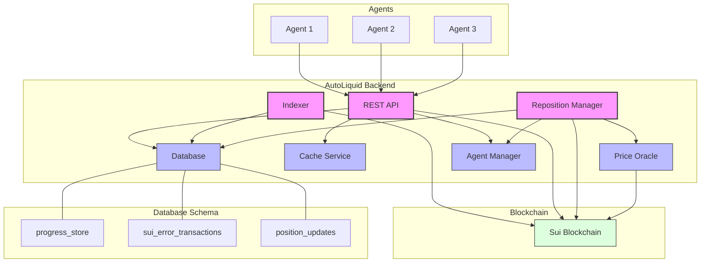

# AutoLiquid Backend Architecture

## System Architecture Diagram

## Component Description

1. **REST API Service**
   - Provides HTTP endpoints for agent clients
   - Handles requests for position data, pool information, etc.
   - Communicates with the database and Sui blockchain

2. **Indexer**
   - Syncs data from the Sui blockchain
   - Processes transactions and updates position information. Keep track all positions and the price at time of adding liquidity
   - Tracks progress using the progress_store table

3. **PostgreSQL Database**
   - Stores all application data
   - Main tables:
     - progress_store: Tracks sync progress
     - sui_error_transactions: Logs failed transactions
     - position_updates: Stores liquidity position information, price at the time of adding liquidity

4. **Cache Service**
   - Provides fast access to frequently requested data
   - Reduces load on the database

5. **Sui Blockchain**
   - External blockchain system
   - Source of liquidity position data

6. **Reposition Manager**
   - Implements auto-repositioning liquidity logic
   - Monitors positions and market conditions
   - Executes rebalancing transactions when needed
   - Maintains optimal liquidity ranges

7. **Price Oracle**
   - Monitors current market prices
   - Provides price feeds for token pairs
   - Supports decision-making for repositioning logic

8. **Agent Manager**
   - Secure agent signer for operation

## Data Flow

1. Agents can register to Agent Manager through REST API
2. The Indexer continuously polls the Sui blockchain for new transactions and events
3. Position updates are processed and stored in the database
4. The REST API service serves data to agent clients
5. The Reposition Manager continuously monitors managed positions and prices
6. When price movement triggers a reposition:
   - Request signer from Agent Manager
   - Liquidity is removed from the old position
   - A new position is created with range of current price
   - Transaction results are stored in the database

## Repositioning Logic

The Reposition Manager implements an automated strategy for maximizing liquidity efficiency:

1. **Initial Position Creation**
   - Accepts two token types and initial amounts as parameters
   - Calculates a price range of ±5% around the current market price
   - Adds the specified liquidity within this calculated range

2. **Position Monitoring**
   - Continuously monitors the current market price via the Price Oracle
   - Tracks price movement relative to the managed range
   - Evaluates the position's capital efficiency

3. **Rebalancing Trigger**
   - When price moves 2% from the position's center point, initiates rebalancing
   - Calculates a new ±5% range around the current price

4. **Repositioning Execution**
   - Request signer from Agent Manager
   - Removes liquidity from the old range
   - Handles the asymmetric token balance resulting from price movement
   - May split into multiple positions if token ratios require it
   - Adds equivalent value of liquidity to the new range(s)
   - Updates position records in the database

5. **Transaction Management**
   - Submits transactions to the Sui blockchain
   - Handles transaction failures and retries
   - Records successful repositioning events

## Database Schema Overview

### progress_store

Tracks the synchronization progress of blockchain data

### sui_error_transactions

Logs transactions that failed during processing

### position_updates

Stores liquidity position data from the blockchain with indexes for efficient querying

## Implementation Considerations

- In the current implementation, use Inmemory Singer Storage to replace Agent Manager
- Use a robust ORM like Diesel for database interactions
- Implement proper error handling and retry mechanisms for blockchain interactions
- Implement proper logging and monitoring
